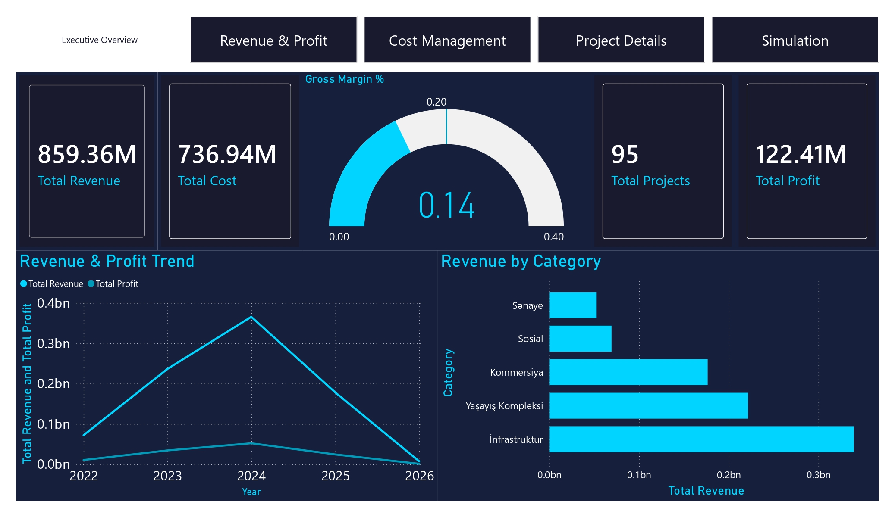
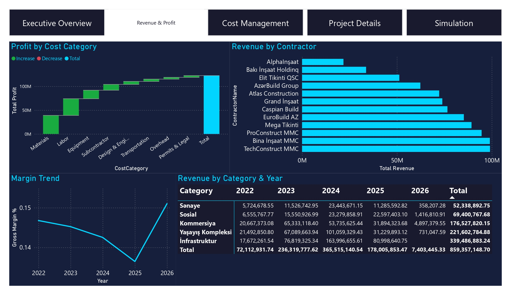
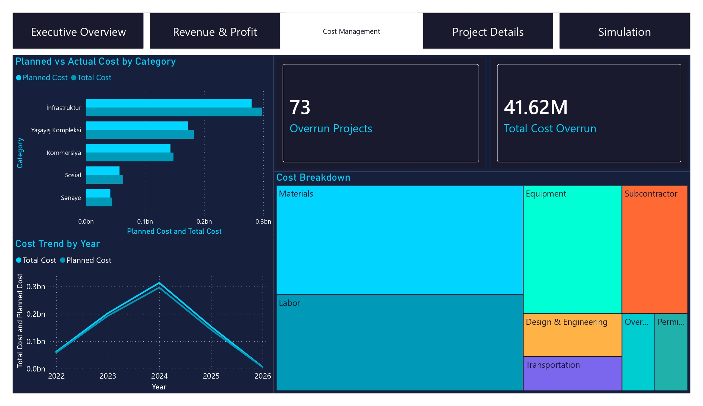
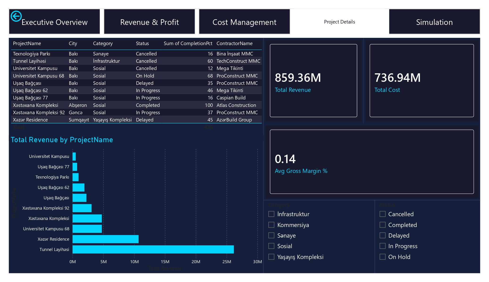
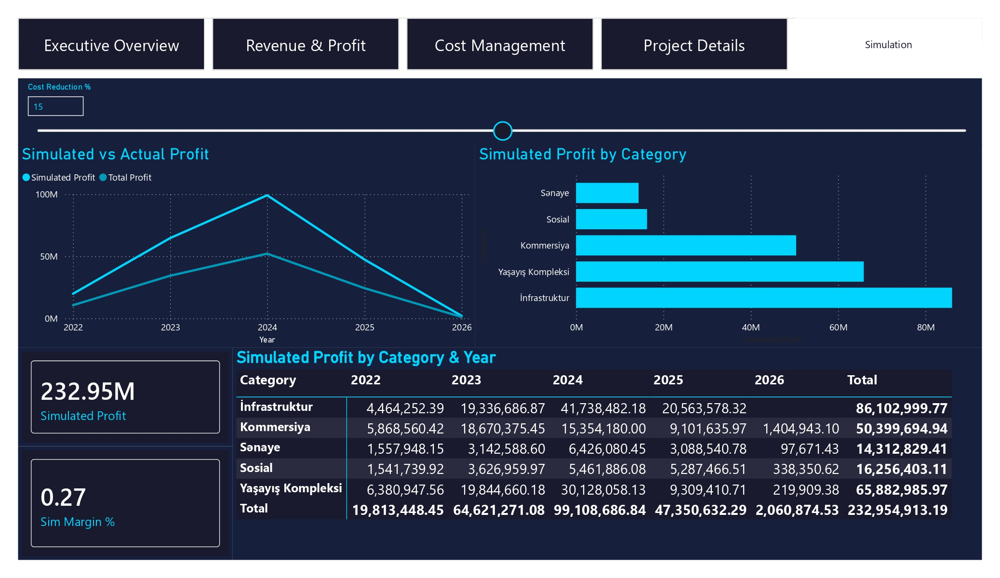

# 🏗️ Construction Financial Analytics Dashboard — Power BI


## 📸 Screenshots

### 1. Executive Overview


### 2. Revenue and Profit


### 3. Cost Management


### 4. Project Details


### 5. Simulation


---

## 📌 Project Overview

An advanced **Construction Financial Analytics Dashboard** built with Power BI, designed to monitor revenue, costs, profitability, and simulate financial scenarios across a multi-project construction portfolio.

This project covers **95 construction projects**, **12 contractors**, and **3+ years of financial data** across Azerbaijan.

---

## 🎯 Business Objectives

- Track **revenue vs planned** and identify variance across projects and categories
- Monitor **cost overruns** and analyze spending by cost category
- Measure **gross margin %** and profitability trends over time
- Simulate **cost reduction scenarios** using What-if analysis
- Enable **drill-through** analysis at project level

---

## 📊 Dashboard Pages

| Page | Description |
|------|-------------|
| 📋 Executive Overview | Portfolio KPIs — Total Revenue, Cost, Profit, Gross Margin %, Gauge |
| 💰 Revenue & Profit | Waterfall, Contractor ranking, Category × Year matrix, Margin trend |
| 📉 Cost Management | Planned vs Actual cost, Cost breakdown treemap, Overrun analysis |
| 🔍 Project Details | Project-level table, Top 10 by revenue, Category & Status slicers |
| 🔮 Simulation | What-if cost reduction simulator, Simulated Profit by Category & Year |

---

## 🗂️ Data Model (Star Schema)

```
fact_financials (11,432 rows)
    ├── dim_projects (95 rows)
    │       └── dim_contractors (12 rows)
```

### Key Fields

| Table | Key Columns |
|-------|-------------|
| fact_financials | PlannedRevenue, ActualRevenue, PlannedCost, ActualCost, GrossProfit, GrossMarginPct |
| dim_projects | ProjectName, Category, City, Status, CompletionPct, PlannedBudget_AZN |
| dim_contractors | ContractorName, Specialization, Rating |

---

## ⚡ Advanced Features

- **What-if Parameter** — Cost Reduction % simulator (0–30%)
- **Navigation Bar** — Page Navigator for seamless UX
- **Gauge Chart** — Gross Margin % vs 20% target
- **Waterfall Chart** — Profit breakdown by cost category
- **Matrix** — Revenue/Profit by Category × Year
- **Custom Dark Theme** — Navy + Cyan color scheme

---

## 🛠️ Tech Stack

- **Power BI Desktop** — Dashboard & visualization
- **DAX** — Advanced calculations & What-if simulation
- **Python** — Synthetic data generation (Pandas, NumPy)
- **Star Schema** — Data modeling

---

## 👩‍💻 Author

**Fatima Chalabi** — Data Analyst / BI Developer  
[](https://linkedin.com/in/fatimachalabi)
[](https://github.com/FatimaChalabi)

---
